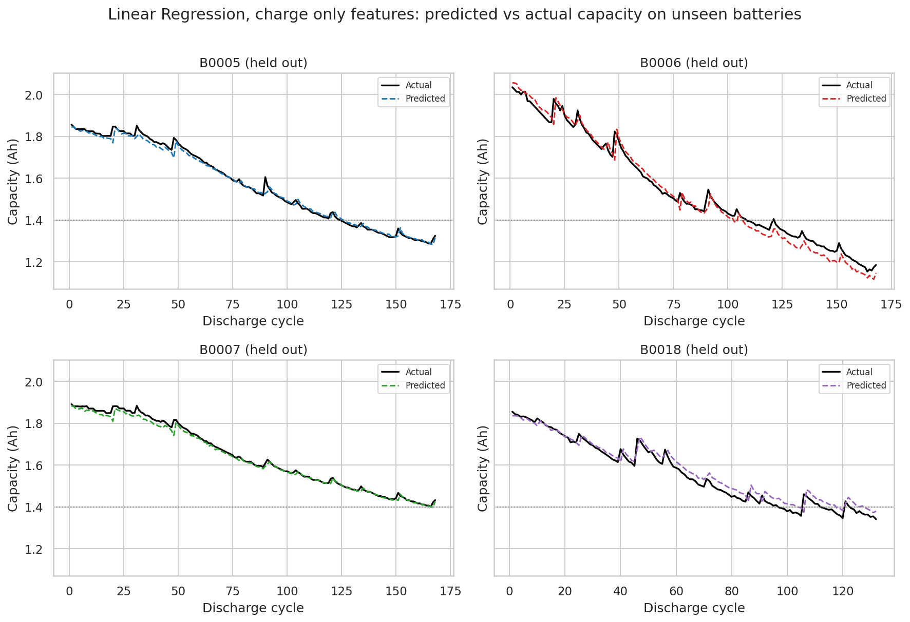
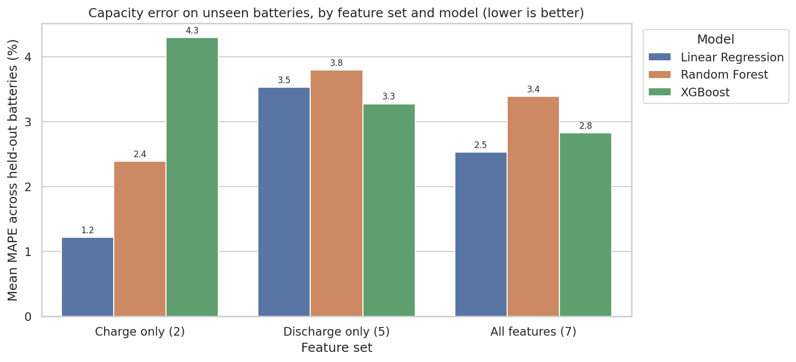

# Lithium-Ion Battery State of Health Prediction

Estimating how much capacity a lithium-ion cell has left, **on batteries the model has never seen**, using health indicators engineered from NASA's battery aging data.

**Best result:** Linear Regression on two charge-phase features estimates capacity with **1.2% mean absolute percentage error (R² 0.98, RMSE 0.024 Ah)** under leave-one-battery-out validation, and predicts the end-of-life cycle within 1 to 7 cycles.



## Key findings

1. **Two simple charge features beat all seven combined.** Constant-current and constant-voltage charge times generalize across cells. Discharge features track capacity well within one battery but carry battery-specific offsets (B0006 sits on a shifted curve), so adding them made predictions on new cells worse (2.5% vs 1.2% MAPE).
2. **Data cleaning was the biggest lever.** Some charge cycles did not start from a fully discharged cell, which shortens the charge and corrupts the feature. Detecting and fixing them, without using the target, cut error from **5.9% to 1.2% MAPE** and raised R² from **0.66 to 0.98**.
3. **Simpler models generalized better.** With only three training batteries, Random Forest and XGBoost could not predict below the capacity range they had seen. Linear Regression extrapolates naturally and had the lowest error on both the charge-only and all-features sets.
4. **Not every correlated feature is a health signal.** Charge temperature rise looked useful but mostly measured how long the cell rested before charging (it read 0 for 101 of 132 B0018 cycles), so it was removed.



## Approach

| Step | What was done |
| --- | --- |
| Restructure | Flattened nested MATLAB structs (2.09M raw measurements) into a long time-series table and a cycle-level table, pairing each discharge with the charge before it |
| Feature engineering | 7 health indicators from the charge cycle and an early, partial window of the discharge. Full discharge time was deliberately excluded because capacity equals current multiplied by discharge time, which would leak the answer |
| Cleaning | Flagged abnormal charges (high starting voltage plus a jump in charge time), interpolated them within each battery, dropped capacity glitches, documented every step in `outputs/cleaning_log.json` |
| Validation | Leave-one-battery-out: train on three cells, test on the fourth, repeated for all four, so no cycles from the test battery are ever seen in training |
| Models | Linear Regression, Random Forest, XGBoost, across three feature sets (charge only, discharge only, all) |
| Metrics | RMSE, MAE, MAPE, R², plus end-of-life cycle error at the 1.4 Ah (30% fade) threshold |

### Engineered features

| Feature | Source | Description |
| --- | --- | --- |
| `cc_charge_time_s` | Charge | Seconds in constant-current charging before voltage reaches 4.2 V |
| `cv_charge_time_s` | Charge | Seconds in constant-voltage charging until current falls below 0.1 A |
| `v_drop_time_3p8_3p5_s` | Discharge (partial) | Seconds for voltage to fall from 3.8 V to 3.5 V |
| `voltage_at_500s_v` | Discharge (partial) | Voltage 500 s into the discharge |
| `voltage_at_1000s_v` | Discharge (partial) | Voltage 1000 s into the discharge |
| `temp_rise_first_1000s_c` | Discharge (partial) | Temperature rise in the first 1000 s |
| `initial_voltage_sag_v` | Discharge (partial) | Voltage drop in the first seconds (internal resistance proxy) |

### Results for the best model (Linear Regression, charge features)

| Held-out battery | RMSE (Ah) | MAPE (%) | R² | Actual EOL cycle | Predicted EOL cycle |
| --- | --- | --- | --- | --- | --- |
| B0005 | 0.016 | 0.67 | 0.993 | 125 | 126 |
| B0006 | 0.034 | 1.93 | 0.981 | 109 | 105 |
| B0007 | 0.015 | 0.56 | 0.992 | never reached | never reached |
| B0018 | 0.029 | 1.71 | 0.964 | 97 | 104 |

## Project structure

```
battery-soh-prediction/
├── data/                       NASA .mat files and data notes
│   └── processed/              cycle_features.csv (generated)
├── notebooks/
│   └── battery_soh_analysis.ipynb   full walkthrough with outputs
├── outputs/
│   ├── figures/                6 charts
│   ├── metrics_by_battery.csv  every model x feature set x held-out battery
│   ├── metrics_summary.csv     averaged across held-out batteries
│   ├── predictions.csv         out-of-fold predictions
│   ├── feature_importance.csv
│   └── cleaning_log.json
├── src/
│   ├── data_processing.py      loading, restructuring, cleaning
│   ├── features.py             feature engineering
│   ├── modeling.py             models, validation, metrics
│   └── visualize.py            figures
├── run_pipeline.py             runs everything end to end
├── make_notebook.py            rebuilds and executes the notebook
└── requirements.txt
```

## How to run

```bash
pip install -r requirements.txt
python run_pipeline.py          # processes data, trains models, writes metrics and figures
python make_notebook.py         # optional: rebuilds the notebook with fresh outputs
```

## Limitations and next steps

* Four cells from one lab at room temperature. The next step is validating on larger, more varied data such as the Stanford/MIT/Toyota fast-charging dataset.
* End of life is estimated by applying the 1.4 Ah threshold to predicted capacity. A forecasting model on the capacity trajectory (Gaussian process or LSTM) would predict further ahead.
* Battery-level random effects or transfer learning could account for cell-to-cell offsets like B0006's.

## Data

NASA Prognostics Center of Excellence battery dataset (Saha and Goebel, 2007). See `data/README.md` for details.
